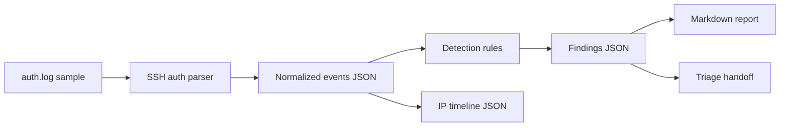

# Architecture

SSH Brute-Force Detector is a defensive lab project for parsing Linux auth logs and highlighting repeated SSH login failures.

## Current MVP

- Parses failed and successful SSH password login events.
- Counts failed logins by source IP and targeted user.
- Detects brute-force behavior above a configurable threshold.
- Escalates fast attack windows and successful login after repeated failures.
- Emits events, findings, summary, IP timeline, report, and triage artifacts.

## Future Product Shape

- Streaming parser for larger auth logs.
- Allowlist and suppression workflow for trusted admin sources.
- Alert delivery to Slack or webhook destinations.
- Optional dashboard for SOC-style triage.
